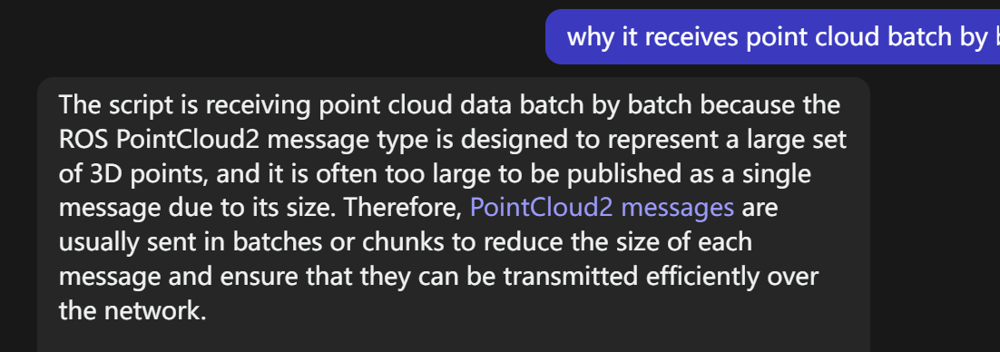

# RosMqttBridge

中文版: [链接](./README_ZH.md)

This project is to establish bidirectional communication between the local host and the IoT device using an MQTT bridge. For the IoT device we use, it is integrated with the ROS system and features a camera that can capture both point cloud and image data. By enabling the algorithm, the device can process this data and publish it to the local ROS topic. This device can also transmit data over a network. Due to the unknown public IPs of both the IoT device and the local host, as well as the large amount of data to be transferred and the unstable networking circumstances, we opted to to use the MQTT protocol to facilitate their long-range data transfer.

## Architecture Diagram


## Getting Started

The project consists of three main components: an IoT device, a cloud platform, and a local host. The program are run in the localhost and device deparately. 

### Prerequisites

The things you need before installing the software.

* The device with ROS and other capturing capabilities.
* A reliable cloud server with public IP. It doesn't matter which cloud you choose (e.g., AWS EC2, Aliyun ECS or Tencent Cloud VM)
* The localhost should have Linux environment and ROS installed.

### Installation


1. Have Eclipse Mosquitto properly installed in IoT device, cloud and localhost, following [link](https://mosquitto.org/download/), and configure the firewall in the cloud system to allow inbound traffic on port 1883. Check if it's binding to all available network interfaces by entering
   
```
$ netstat -an | grep 1883
tcp        0      0 0.0.0.0:1883            0.0.0.0:*               LISTEN  
```

## Usage

A few examples of useful commands and/or tasks.

```
$ First example
$ Second example
$ And keep this in mind
```

## Deployment

Additional notes on how to deploy this on a live or release system. Explaining the most important branches, what pipelines they trigger and how to update the database (if anything special).

### Server

* Live:
* Release:
* Development:

### Branches

* Master:
* Feature:
* Bugfix:
* etc...

## Additional Documentation and Acknowledgments

* Project folder on server:
* Confluence link:
* Asana board:
* etc...


---------------------Old------------------------------------------
暂时不考虑，这些在launcher里面的

python ros_to_mqtt.py -H <mqtt_broker_host> -P <mqtt_broker_port> -FT <ros_from_topic> -TT <mqtt_to_topic> -MT <message_type>

python mqtt_to_ros.py -H <mqtt_broker_host> -P <mqtt_broker_port> -FT <mqtt_from_topic> -TT <ros_to_topic> -MT <message_type>


正常用MQTT的command:

mosquitto_pub -h 121.41.94.38 -p 1883 -t ABC -m "Hello World!"
mosquitto_sub -h 121.41.94.38 -p 1883 -t ABC

如果在
## Requirements

- mosquitto(localhost:1883)

## Run

launch bridges
```
$ python std_msgs_string.py
```

launch subscribers
```
$ rostopic echo /ros/test/std_msgs_string
```

```
$ mosquitto_sub -d -t /mqtt/test/std_msgs_string -v
```

publish
```
$ rostopic pub -1 /ros/test/std_msgs_string std_msgs/String "data: 'test text from ros'"
```

```
$ mosquitto_pub -d -t /mqtt/test/std_msgs_string -m '{"data": "test text from mqtt"}'
```




TODO: 

1. When the IoT device is booted, it should automatically run a program listening on (subscribing to) the specified broker. (ask gpt: how to make a Linux IoT device run a program automatically when it boots)

2. 